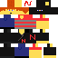
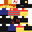

## Minecraft Skins:

My skin looks roughly like this:

## [New skins]()
(changes orange N on back into
red N, also can take the ninja suit off)

## [Old skins](../old/)
(does not have the ability to take suit off; has an orange N on the back)

#### New Alex Modeled Skin:

[Apply to Minecraft](apply)

#### New Steve Modeled Skin:

[Apply to Minecraft](apply/steve)