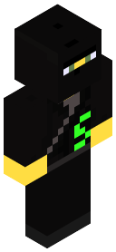
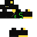

## Minecraft Skins:

FitzenS's skin looks roughly like this:

## [New skin](../new/)
(can take suit off)

## [Old skin]()
(does not have the ability to take suit off)

#### Old Steve Modeled Skin:

[Apply to Minecraft](apply)